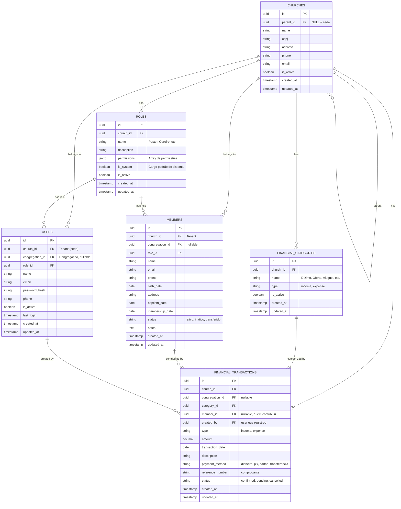

# 02 - Modelagem de Dados

Este documento lista as principais entidades, campos principais, relacionamentos e regras de negócio da base de dados PostgreSQL.

## Entidades Principais e Relacionamentos

## Regras de Negócio e Tenancy
1. `church_id` é o **tenant**. Toda consulta filtra automaticamente por este campo para isolamento.
2. Permissões não são colunas estáticas nas tabelas de users. Elas são amarradas pela tabela `ROLES` via campo `permissions` (ex: `['members:read', 'financial:write']`).
